# COMP304 Project 1 - Shell-ish

## Student

-   **Name:** Ahmet Buğra Ertürk
-   **ID:** 0086877
-   **Email** aerturk23@ku.edu.tr

## Introduction

Shell-ish is an interactive Unix-style command-line
interpreter developed in C. The project
focuses on core operating system concepts including process creation via
forking, manual path resolution using environment variables to replace
`execvp` with `execv`, I/O redirection, and inter-process communication
through piping.

## Repository and Usage

**GitHub Repository:** <https://github.com/ahmetbugraerturk/COMP304_Project1_Shell-ish>

## How to Build

To compile the shell and new commands using `gcc`. A Makefile is also provided. Run the following
command in your terminal:

    make

## How to Run

Launch the shell directly or with line editing
support:

1.  `./shell-ish`

2.  `rlwrap ./shell-ish`

# Features Usage

-   **Standard Commands:** Run programs available in the system path
    like `ls`, `mkdir`, and `cp`.

-   **Background Processes:** Append `&` to any command to execute it
    without blocking the shell.

    

      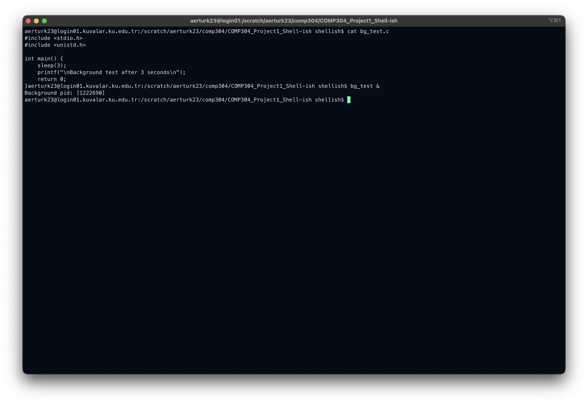
      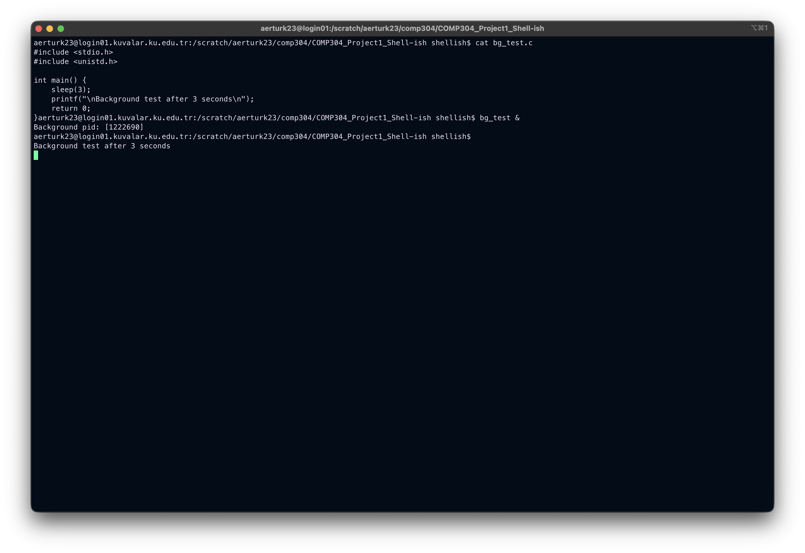
    

-   **Redirection:** Redirect the output of a command to a file.

    

-   **Piping:** Pipe the output of one command to the input of another command.

    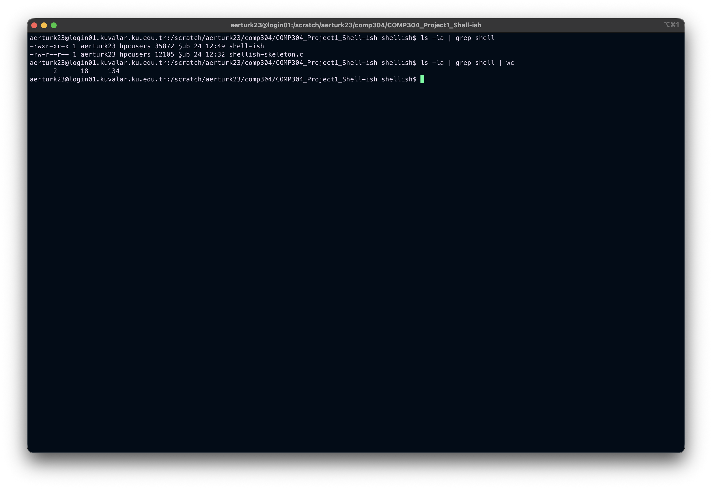

-   **cut command:** A custom command that implements the functionality of the cut command.
    * Usage: `cut -d <delimiter> -f<field_number>`
    * Example: `cut -d ":" -f1,6`
 
    

      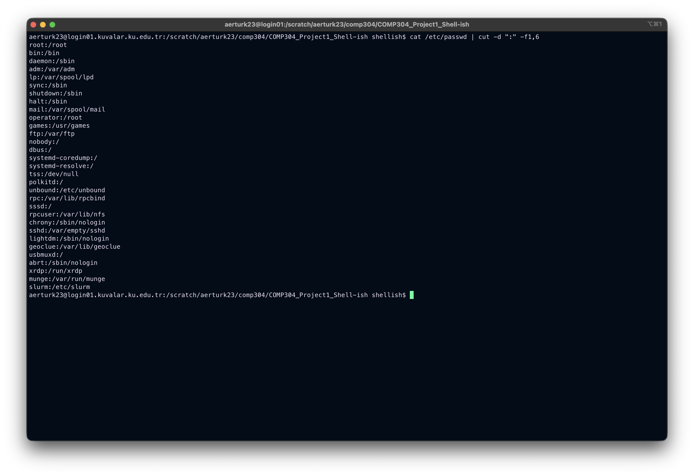
      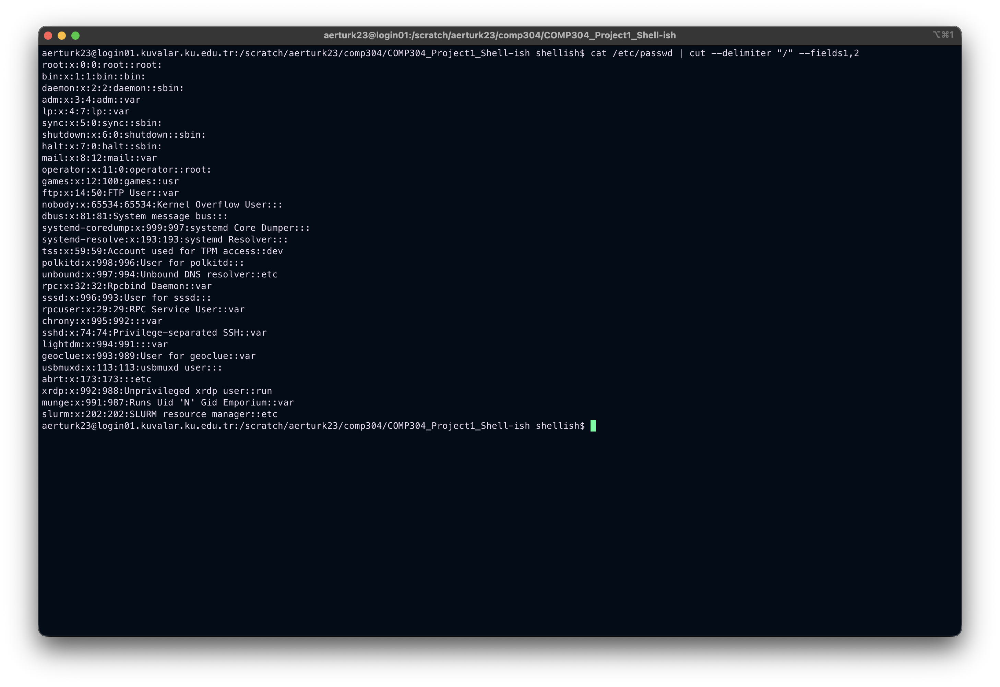
    

-   **chatroom command:** A custom command that allows users to chat with each other  using named pipes.
    * Usage: `chatroom <room_name> <user_name>`
    * Example: `chatroom comp304 bugra`
 
    

      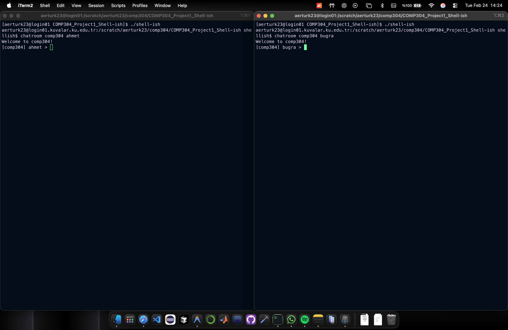
      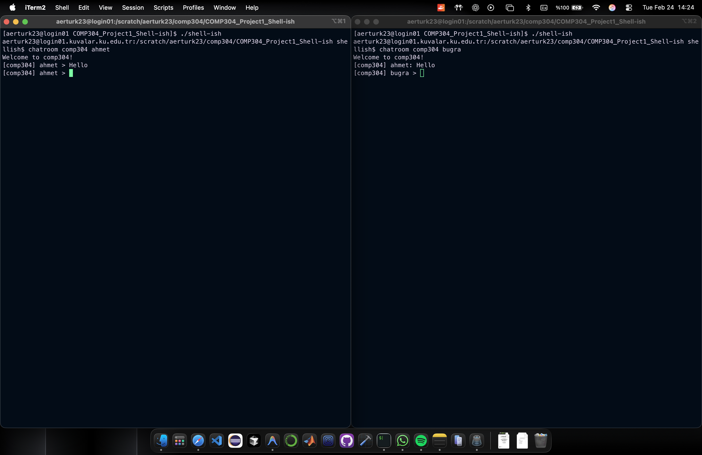
      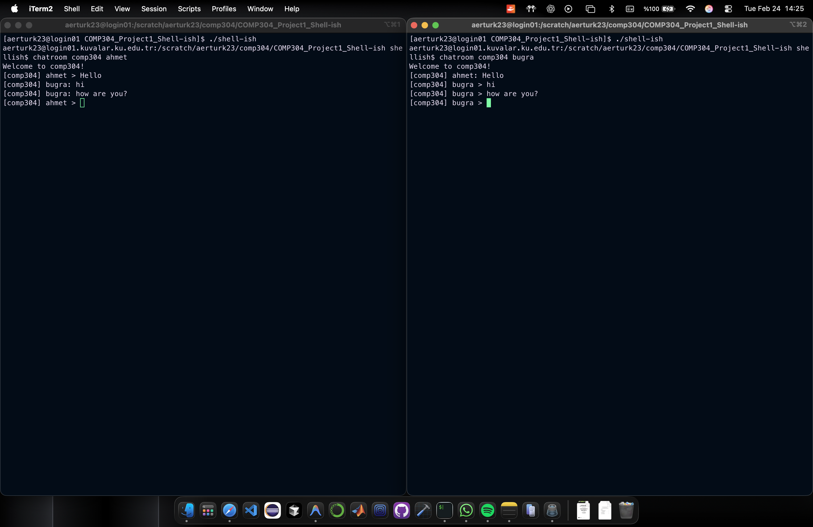
    

-   ***hangman command (my custom command):*** A custom command that allows two users to play hangman with each other using named pipes.
    * Usage: `hangman -m` (moderator) or `hangman -p` (player)

    * Named pipe is created in /tmp/hangman/fifo for communication between moderator and player.

    * How to play:
        1. Open two terminals.
        2. In the first terminal, run `hangman -m`.
           
           
        3. In the second terminal, run `hangman -p`.
     
           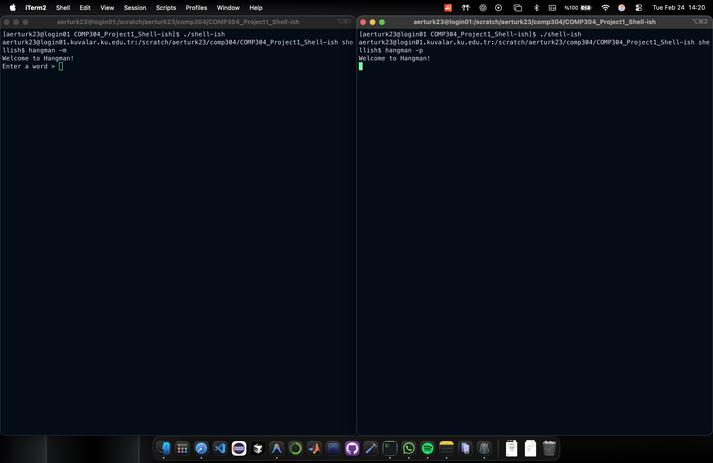
        4. The moderator will enter a word, and this process will terminated. The game starts at the players screen.
     
           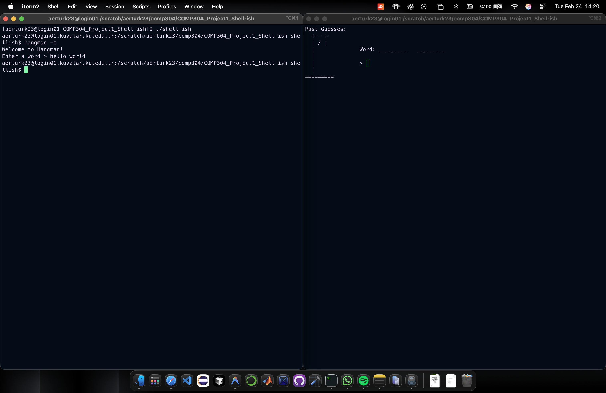
        5. The player will guess letters one by one.
     
           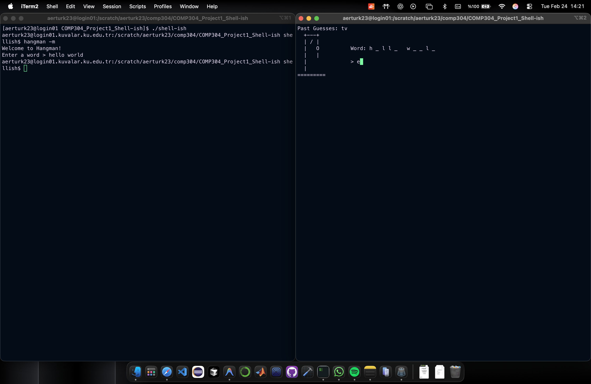
        6. The game ends when the player guesses the word or runs out of lives.

           

              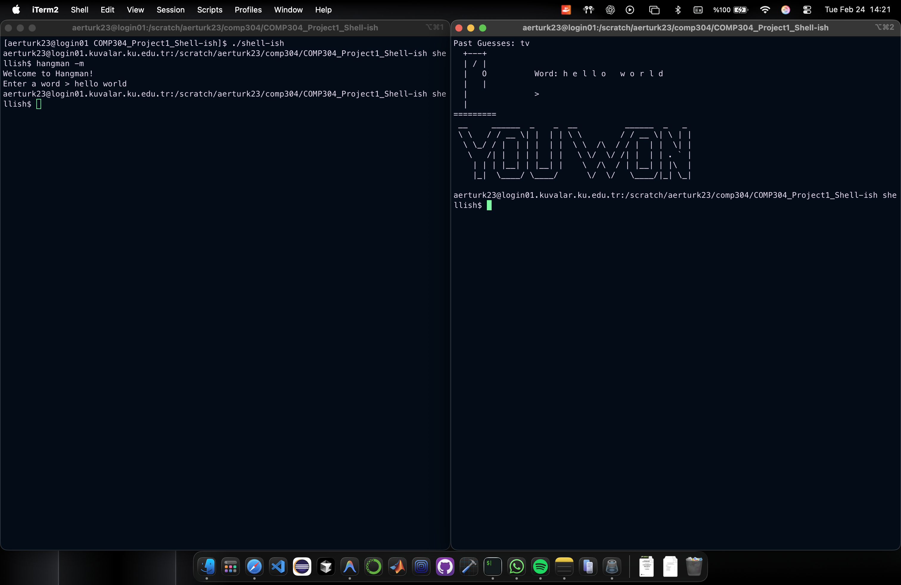
              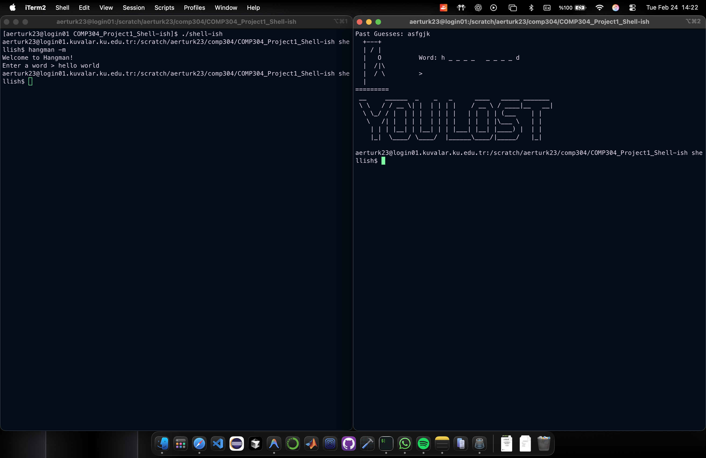
           

# References

* Gemini helps me about the usage of aboves:
  * Template and proofreadings of this README.md file.  
  * `getenv("PATH")`: to find the paths of commands.
  * `access(char *path, F_OK)`: it returns 0 if the path exists.  
  * `dup2()` and `dup()` functions
  * `fcntl.h` package
  * `atoi()` function
  * `fgets()` function
  * `waitpid()` function
  * `WNOHANG` as a suggestion from TA
  * `mkfifo()` and `mkdir()` permissions
  * `dirent.h` package
  * `fflush()` function
  * hangman stages
  * hangman lost and won messages
* unix-pipe.c example
  * pipe codes.
* named-pipes-writes-first.c example
  * named pipe codes.

